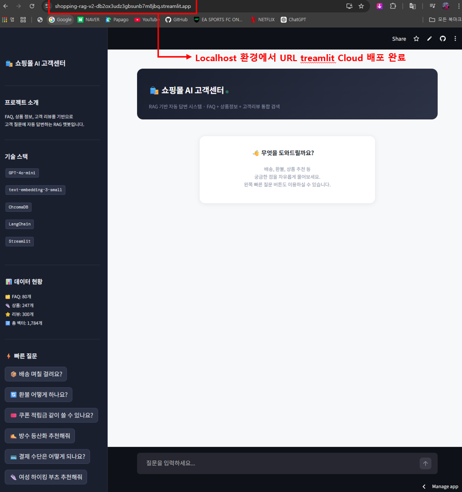
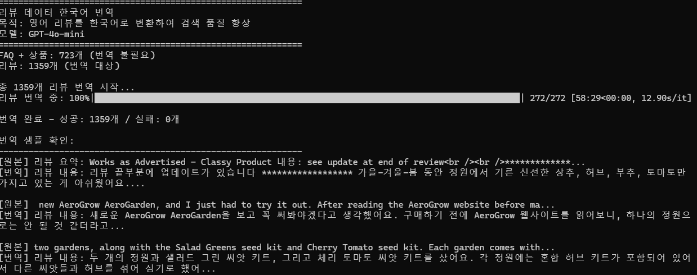
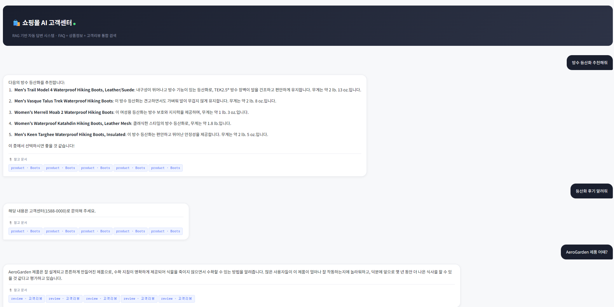
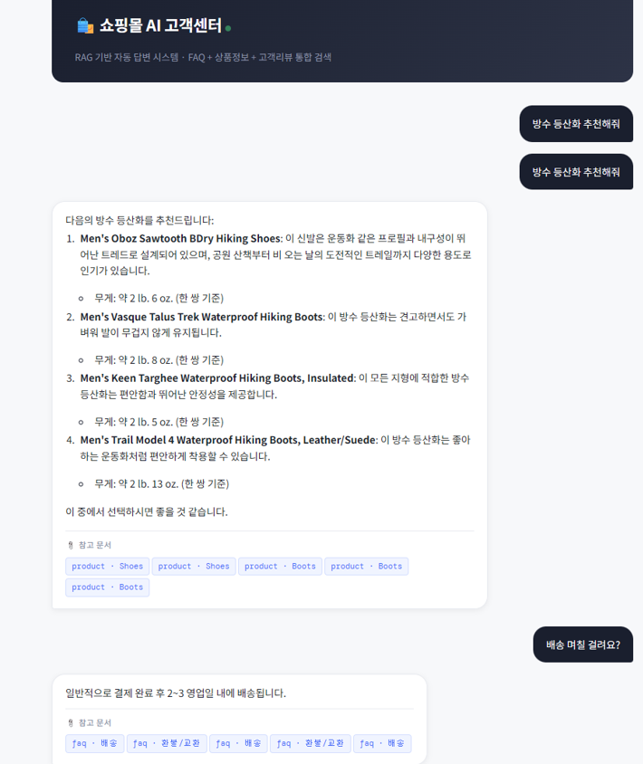

# 쇼핑몰 RAG 챗봇 v2

> FAQ, 상품 정보, 고객 리뷰를 기반으로 고객 질문에 자동 답변하는 RAG 챗봇 — v1 대비 리뷰 번역, Re-ranking, 소스 필터링 개선


🚀 **라이브 데모**: [https://shopping-rag-v2-db2ox3udz3gbsunb7m8jbq.streamlit.app](https://shopping-rag-v2-db2ox3udz3gbsunb7m8jbq.streamlit.app)


---

## v1과의 차이점

> v1 레포: [shopping-faq-rag](https://github.com/HyeonBin0118/shopping-faq-rag)

| 항목 | v1 | v2 |
|---|---|---|
| 리뷰 데이터 언어 | 영어 (원본) | **한국어 번역본** |
| 리뷰 검색 가능 여부 | ❌ 한국어 질문으로 검색 불가 | ✅ 한국어 질문으로 검색 가능 |
| Re-ranking | ❌ 없음 | ✅ Cohere Rerank v3.5 |
| 소스 필터링 | 상품/FAQ만 | 리뷰/상품/FAQ 동적 필터링 |
| 청크 사이즈 | 500 (기본값) | 300 (실험 후 채택) |
| 배포 | 로컬 실행 | **Streamlit Cloud 배포** |

---

## 프로젝트 개요



v1에서 발견한 3가지 문제를 개선했습니다.

1. **영어 리뷰 검색 불가** — 한국어 질문으로는 영어 리뷰 데이터를 검색할 수 없었음
2. **벡터 유사도만으로는 검색 순서 부정확** — Re-ranking 없이 단순 유사도 순 정렬
3. **리뷰 소스 필터링 누락** — 소스 필터링 로직에서 review 소스가 제외되는 버그

---

## 기술 스택

| 분류 | 기술 |
|---|---|
| 언어 | Python 3.11 |
| 임베딩 | `text-embedding-3-small` (OpenAI) |
| 벡터 DB | ChromaDB |
| LLM | GPT-4o-mini |
| Re-ranking | Cohere Rerank v3.5 |
| RAG 프레임워크 | LangChain |
| UI | Streamlit |
| 번역 | GPT-4o-mini (리뷰 1,359개 한국어 번역) |

---

## 프로젝트 구조

```
shopping-rag-v2/
├── chunks_translated.jsonl      # 한국어 번역된 청크 데이터 (2,082개 → 1,784개)
├── chroma_db/                   # 번역 데이터 기반 벡터 DB
├── step2_embedding.py           # OpenAI 임베딩 + ChromaDB 구축
├── step4_streamlit_app.py       # 챗봇 UI (Re-ranking + 소스 필터링 포함)
├── chunk_size_experiment.py     # 청크 사이즈 실험 (300/500/700 비교)
├── translate_reviews.py         # 리뷰 한국어 번역
├── images/                      # 포트폴리오 스크린샷
└── requirements.txt
```

---

## 개선 과정

### 1. 리뷰 한국어 번역

**문제:** v1에서 영어로 된 리뷰 1,359개가 있었지만, 한국어 질문으로는 검색이 되지 않았습니다.

```
# v1: 한국어 질문 → 영어 리뷰 검색 실패
질문: "AeroGarden 제품 어때?"
결과: 해당 내용은 고객센터(1588-0000)로 문의해 주세요.
```

**해결:** GPT-4o-mini로 리뷰 1,359개를 한국어로 번역 후 재임베딩했습니다.

```python
# translate_reviews.py 핵심 로직
response = client.chat.completions.create(
    model="gpt-4o-mini",
    messages=[{
        "role": "user",
        "content": f"다음 영어 리뷰를 자연스러운 한국어로 번역해주세요:\n{review_text}"
    }]
)
```



1,359개 번역 완료 (성공: 1,359개 / 실패: 0개)

**결과:**



```
# v2: 한국어 질문 → 한국어 번역 리뷰 검색 성공
질문: "AeroGarden 제품 어때?"
결과: AeroGarden 제품은 잘 설계되고 튼튼하게 만들어진 제품으로,
      수확 지침이 명확하게 제공되어 식물을 죽이지 않으면서도 수확할 수 있는
      방법을 알려줍니다. (review · 고객리뷰)
```

**번역 비용:** 1,359개 기준 약 $0.02

---

### 2. 청크 사이즈 실험

v1에서 기본값 500을 사용했던 청크 사이즈를 300/500/700으로 비교 실험했습니다.

```python
# chunk_size_experiment.py
for chunk_size in [300, 500, 700]:
    splitter = RecursiveCharacterTextSplitter(
        chunk_size=chunk_size,
        chunk_overlap=50
    )
```

**실험 결과:**

| chunk_size | Faithfulness | Context Precision | Context Recall |
|---|---|---|---|
| 300 | 0.875 | 0.875 | 0.875 |
| 500 | 0.875 | 0.875 | 0.875 |
| 700 | 0.875 | 0.875 | 0.875 |

> **인사이트:** FAQ 데이터는 이미 질문-답변 쌍으로 구성되어 있어 평균 길이가 짧기 때문에 청크 사이즈의 영향이 거의 없었습니다. 데이터 특성을 먼저 파악한 후 실험으로 검증하는 것이 중요하다는 것을 확인했습니다. chunk_size=300을 최종 채택했습니다.

---

### 3. Re-ranking 적용

**문제:** 벡터 유사도 기반 검색은 의미적 유사도는 잘 잡지만, 질문과의 실제 관련성 순서가 부정확할 수 있습니다.

**해결:** Cohere Rerank v3.5로 검색된 문서를 Cross-Encoder 방식으로 재정렬했습니다.

```
[기존 파이프라인]
질문 → 벡터 검색 (top 20) → 상위 5개 → LLM 답변

[Re-ranking 적용 후]
질문 → 벡터 검색 (top 20) → Cohere Rerank → 상위 5개 → LLM 답변
```

```python
# Re-ranking 핵심 코드
response = cohere_client.rerank(
    model="rerank-v3.5",
    query=question,
    documents=[d.page_content for d in filtered_docs],
    top_n=5,
)
docs = [filtered_docs[r.index] for r in response.results]
```

**결과:**



Re-ranking 전에는 `product · Boots`만 나왔던 결과가, 적용 후 `product · Shoes`와 `product · Boots`가 혼합되어 더 다양하고 관련성 높은 상품이 추천됩니다.

---

### 4. 소스 필터링 개선

**문제:** v1에서 리뷰 키워드("후기", "어때" 등)가 포함된 질문에도 review 소스가 검색에서 제외되는 버그가 있었습니다.

**해결:** 질문 유형을 3가지로 분류하여 소스를 동적으로 결정합니다.

```python
review_keywords = ["후기", "리뷰", "사용기", "어때", "어떤가요", ...]

if is_review_query and is_product_query:
    allowed = {"review", "product", "faq"}  # 상품 후기 질문
elif is_review_query:
    allowed = {"review", "faq"}             # 일반 후기 질문
elif is_product_query:
    allowed = {"product", "faq"}            # 상품 추천 질문
else:
    allowed = {"faq"}                       # 일반 FAQ 질문
```

---

## 설치 및 실행

```bash
# 1. 환경 설정
conda create -n rag_env python=3.11
conda activate rag_env
pip install -r requirements.txt

# 2. API 키 설정
set OPENAI_API_KEY=sk-...    # Windows
set COHERE_API_KEY=...       # Windows

# 3. 임베딩 구축 (chunks_translated.jsonl 기반)
python step2_embedding.py

# 4. Streamlit UI 실행
streamlit run step4_streamlit_app.py
```

---

## API 사용 비용

| 항목 | 비용 |
|---|---|
| 리뷰 번역 1,359개 (gpt-4o-mini) | ~$0.02 |
| 재임베딩 1,784개 (text-embedding-3-small) | ~$0.003 |
| RAG 테스트 쿼리 | ~$0.01 |
| **합계** | **~$0.033 (약 50원)** |

---

## 개발 인사이트

- 데이터 언어 불일치는 아무리 좋은 모델을 써도 검색 자체가 불가능하게 만든다 — 번역으로 해결
- 청크 사이즈 실험은 데이터 특성 파악이 선행되어야 의미 있다
- Re-ranking은 벡터 검색의 순서 부정확성을 보완하는 효과적인 방법이다
- 소스 필터링 같은 작은 버그가 전체 검색 품질에 큰 영향을 미친다

---

## 참고 자료

- [LangChain 공식 문서](https://docs.langchain.com)
- [ChromaDB 공식 문서](https://docs.trychroma.com)
- [Cohere Rerank 문서](https://docs.cohere.com/docs/rerank)
- v1 레포: [shopping-faq-rag](https://github.com/HyeonBin0118/shopping-faq-rag)
